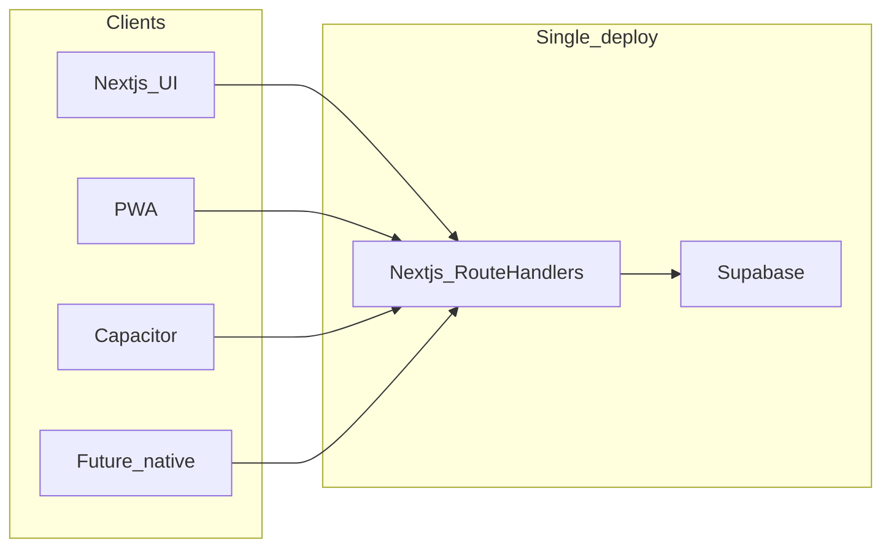

# Creatix architecture

## High level

Creatix is a **Next.js (App Router)** application deployed as a **single unit** (e.g. Vercel): server-rendered pages, client components, and **Route Handlers** under `app/api/` that form the **HTTP API** for any client (browser, PWA, Capacitor WebView, or a future native app).

**Supabase** provides auth, Postgres, and RLS. Server code uses [`lib/supabase/server.ts`](../lib/supabase/server.ts) (cookies / SSR); the browser uses [`lib/supabase/client.ts`](../lib/supabase/client.ts).

## Layers

| Layer | Location | Responsibility |
|--------|-----------|----------------|
| **Web UI** | [`app/`](../app/) (pages, layouts), [`components/`](../components/) | Human-facing dashboard and marketing surfaces. Uses RSC + client components. |
| **HTTP API** | [`app/api/`](../app/api/) | JSON (or binary) endpoints. **Stable contract** for non-browser clients: call these URLs with cookies or bearer tokens per route, do not scrape HTML. |
| **Shared logic** | [`lib/`](../lib/) | Domain logic, AI helpers, integrations. Used by Route Handlers and server components. |
| **Mobile shells** | PWA: [`app/manifest.ts`](../app/manifest.ts); optional Capacitor: [`capacitor.config.ts`](../capacitor.config.ts); notes in [`mobile/README.md`](../mobile/README.md) | Installable or native wrappers; **no duplicate business rules**—they load the same origin or call the same APIs. |

## URLs and environment

- **Canonical public origin** for metadata, OAuth, and webhooks: see [`lib/site-url.ts`](../lib/site-url.ts) (`APP_URL` / `NEXT_PUBLIC_APP_URL`).
- **Secrets**: never commit `.env*.local`. Server-only keys stay server-only.

## Related docs

- [API_SURFACE.md](./API_SURFACE.md) — index of major API groups (incremental).
- [mobile-app.md](./mobile-app.md) — PWA, Capacitor, Expo strategy.
- [AGENTS.md](./AGENTS.md) — parallel work and AI agents.
